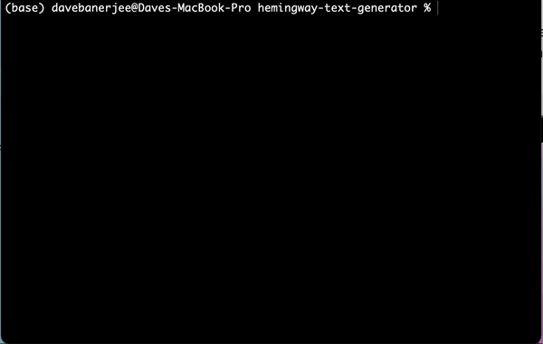

# Ernest Hemingway Text Generator

Welcome to the Ernest Hemingway Text Generator, a decoder-only transformer model designed to perform text completion in the style of Ernest Hemingway. This text generator is based on GPT-1 architecture.

## Overview

### Models:
- 700k parameters
- 1.2m parameters

### How to Use Locally

- Clone repository
- Run the file 'hemingway-text-generator.py'
- You will be prompted to enter the desired length of the generated text in characters, and you will be prompted to provide a few words to serve as a starting point for the model to generate text.
- Model will begin generating text.

### Demo

